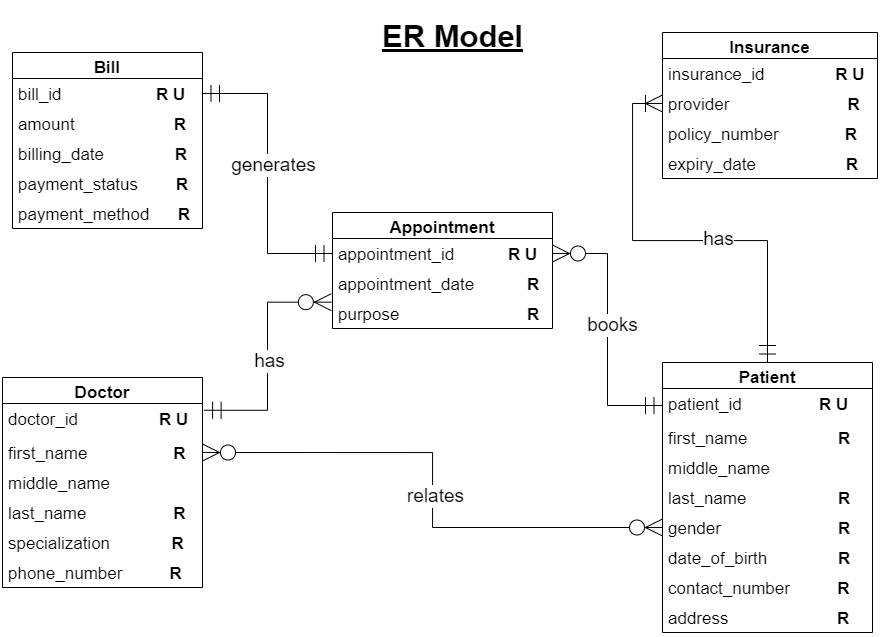

# 🏥 Hospital Management System — SQL Data Modeling & Analytics Project

This project implements a complete **Hospital Management System (HMS)** using SQL.  
It is designed to simulate real clinical workflows including **patients, doctors, appointments, billing, and insurance**.

The project demonstrates:
- Relational database design  
- Clinical data modeling  
- SQL views for reporting  
- Triggers for audit logs and validation  
- Multi-table analytics queries  
- Many-to-many and one-to-one relationships  

---

## 📌 ER Diagram



---

## 📂 Project Structure

| File | Description |
|------|-------------|
| `schema_views_triggers_HMS_samyam.sql` | Full schema, sample data inserts, triggers & views |
| `select_queries_HMS_samyam.sql` | SELECT queries demonstrating joins, aggregates, and filters |
| `ERD.png` | Entity Relationship Diagram (visual model of the database) |

---

## 🧱 Database Schema Overview

The system includes the following core tables:

- **Patient** – demographic & contact information  
- **Doctor** – provider details & specialization  
- **Appointment** – scheduling table linking doctor ↔ patient  
- **Bill** – billing info for each appointment  
- **Insurance** – one-to-one patient insurance record  
- **doctor_patient** – junction table for long-term doctor–patient associations  

### 🔗 Relationship Types Modeled
- **1 : 1** — Patient ↔ Insurance  
- **1 : Many** — Doctor ↔ Appointments, Patient ↔ Appointments  
- **Many : Many** — Doctor ↔ Patient (via `doctor_patient`)  
- **1 : 1** — Appointment ↔ Bill  

---

## 🛠 SQL Features Included

### ✔ **1. Schema & Constraints**
Found in:  
`schema_views_triggers_HMS_samyam.sql`  
:contentReference[oaicite:0]{index=0}

- Primary Keys / Foreign Keys  
- ENUM constraints  
- UNIQUE constraints  
- Composite Primary Key (doctor_patient)  
- Fully normalized structure  

---

### ✔ **2. Triggers (Automation & Data Integrity)**

All implemented in:  
`schema_views_triggers_HMS_samyam.sql`

**• `log_bill_after_insert`**  
Automatically logs new bill entries into `bill_log`.

**• `check_insurance_expiry`**  
Prevents inserting expired insurance policies.

**• `track_appointment_reschedule`**  
Creates audit history whenever an appointment date is changed.

---

### ✔ **3. Analytical SQL Views**

**• `appointment_summary`**  
Doctor ↔ Patient ↔ Appointment reporting view.

**• `paid_bills_view`**  
Shows only completed payments for finance insights.

**• `case_overview`**  
Links doctor workload with patient demographics.

---

## 📊 SELECT Query Examples

Stored in:  
`select_queries_HMS_samyam.sql`  
:contentReference[oaicite:1]{index=1}

Includes demonstrations of:

### 🔹 Basic SQL  
- `SELECT`, `ORDER BY`, `DISTINCT`, `LIKE`, `IN`

### 🔹 Joins  
- INNER JOIN  
- LEFT OUTER JOIN  
- SELF JOIN  

### 🔹 Aggregations  
- `COUNT`, `MAX`, `AVG`  
- `GROUP BY`  
- `HAVING`  

### 🔹 Clinical Analysis Examples  
- Appointment counts per doctor  
- Payment method trends  
- Doctor specialization pairing  
- Patient demographics filtering  

---

## 🚀 How to Run This Project

1. Install **MySQL** (or any compatible SQL engine).  
2. Create a new database:  
   ```sql
   CREATE DATABASE hospital_management;
3. Run the schema, sample data, views, and triggers:
   ```sql
   schema_views_triggers_HMS_samyam.sql
4. Run analytics queries from:
   ```sql
   select_queries_HMS_samyam.sql


## 🎯 Key Learning Outcomes

- **Full relational database design**
- **Healthcare/clinical workflow modeling**
- **ETL-style automation using SQL triggers**
- **Multi-table SQL analytics and reporting**
- **Building reusable SQL views for dashboards**
- **Understanding and enforcing referential integrity**

---

## 👨‍💻 Author

**Samyam Dhamala**  
Graduate Information Science Student | Data Analyst  

🔗 [GitHub](https://github.com/samyamdhamala)  
🔗 [LinkedIn](https://www.linkedin.com/in/samyam-dhamala/)

   
